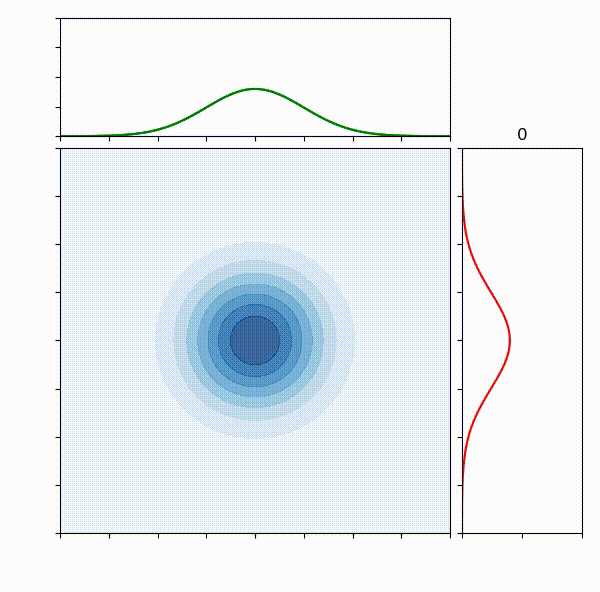

# SampViz
> Visualization of Sampling Methods

A matplotlib-based visualization class to help me better understand different probability space exploration approaches. It currently only
supports Monte Carlo sampling, but I'll work on a Gibbs sampler for MCMC next and take it from there (hopefully) towards 
Metropolis-Hastings and Hamiltonian MC.

## Example
### Monte Carlo sampling

    import scipy.stats
    from sampviz import SampViz
    
    # define two distributions
    dist1 = scipy.stats.norm
    dist2 = scipy.stats.norm
    
    # instantiate the visualization class
    sv = SampViz(dist1, dist2)
    
    # draw samples
    samples = sv.sample_monte_carlo(n_samples)
    
    # and run the animation
    sv.run(samples)

## Dependecies

* `numpy`
* `matplotlib`
* `scipy`